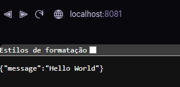
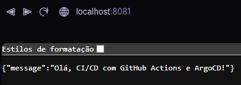

### **Teste do Fluxo Completo de CI/CD**

Agora, vamos provar que o seu pipeline de CI/CD funciona de ponta a ponta.

1. **Altere o código da aplicação**: No arquivo `main.py` do seu repositório `hello-app`, modifique a mensagem de retorno para algo diferente. Por exemplo:
    
    Python
    
    ```bash
    @app.get("/")
    def read_root():
        return {"message": "Olá, CI/CD com GitHub Actions e ArgoCD!"}
    ```
    
2. **Faça o commit e o push**: Salve o arquivo, faça o commit da sua alteração e envie para o GitHub.
    
    
    ```
    git add .
    git commit -m "Atualizando a mensagem da aplicacao"
    git push origin main
    ```
    
3. **Monitore a pipeline**:
    
    - Vá para o seu repositório `hello-app` no GitHub e clique na aba **Actions**.
        
    - Você verá sua pipeline começar a rodar. Acompanhe os passos: build da imagem Docker, push para o Docker Hub e o commit automático no seu repositório `hello-manifests`.
        
    - No ArgoCD, a sua aplicação `hello-app` deve passar do status **`Synced`** para **`OutOfSync`** e, em seguida, para **`Synced`** novamente, mostrando que a nova imagem está sendo implantada.
        
4. **Verifique a mudança**:
    
    - Depois que a sincronização no ArgoCD for concluída, volte para o seu terminal e execute o `port-forward` para a sua aplicação:
        
        
        ```
        kubectl port-forward svc/hello-app-service 8081:80
        ```
        
    - A nova mensagem `{"message": "Olá, CI/CD com GitHub Actions e ArgoCD!"}` deve aparecer, confirmando que a alteração do código foi, com sucesso, construída, publicada e implantada no seu cluster Kubernetes de forma totalmente automatizada.

Concluindo, a porta 8080 estará sendo utilizada pelo ArgoCD e a 8081 pelo App Service.






