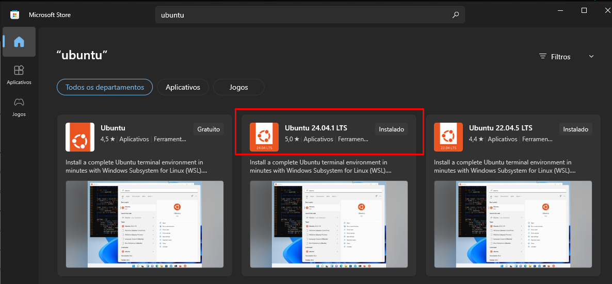
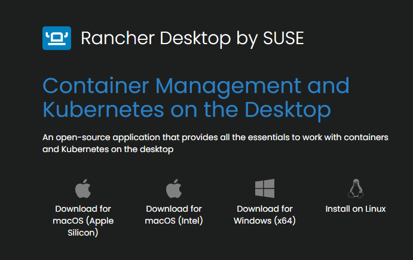
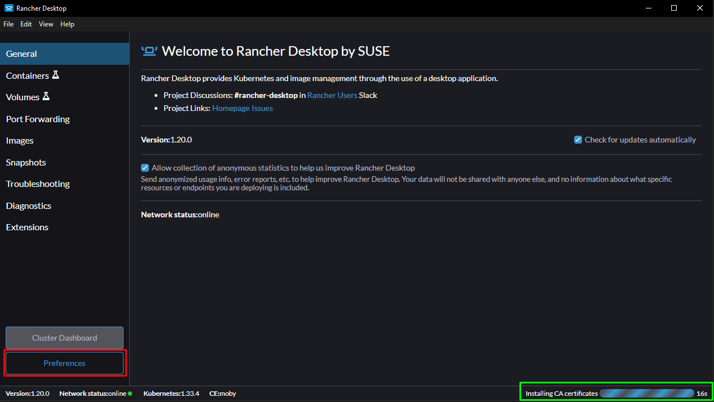
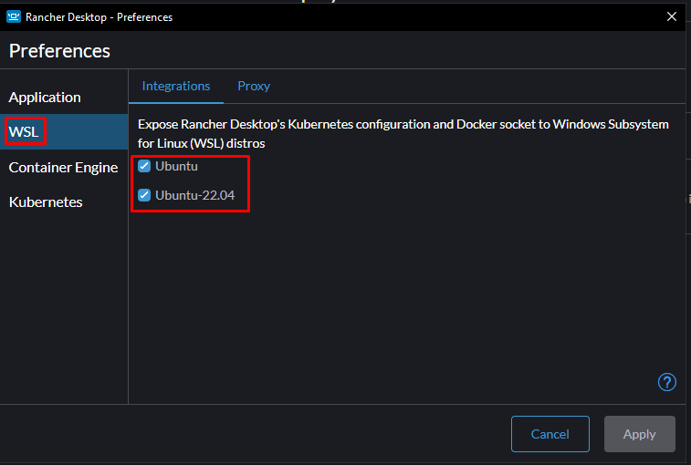

Instalação da WSL numa máquina Windows. Acesse a Microsoft Store e pesquise por Ubuntu, selecione a versão mais recente e clique em instalar.



Rancher Desktop:
Acesse o site https://rancherdesktop.io e faça o download para windows e siga o passo a passo de instalação.


Quando o programa abrir, acesse a aba "Preferences", marcada em vermelho na imagem abaixo.



OBS: A marcação em verde, aguarde ela sumir para prosseguir na utilização do programa, pois ele estará inicializando todos os serviços, então é essencial aguardar.

Busque a aba WSL e marque as opções ubuntu, em seguida pressione "Apply"




Abra o WSL e execute os seguintes comandos:

Este comando vai atualizar a lista de pacotes.
```bash
sudo apt update
```


O Python 3 e o Git já vêm pré-instalados em muitas distribuições, como o Ubuntu. No entanto, é importante garantir que você tenha as versões mais recentes e que o `pip` (gerenciador de pacotes do Python) também esteja disponível.
```bash
sudo apt install git python3 python3-pip
```

Com o Docker Desktop(Rancher) instalado, verifique a versão no terminal
```bash
docker --version
```

Agora verifique se todas as ferramentas foram instaladas corretamentes:
```bash
git --version
python3 --version
pip3 --version
```


Para instalar o ArgoCD no seu cluster Kubernetes local (criado com o Rancher Desktop, por exemplo), você precisará usar o `kubectl` para aplicar os manifestos de instalação.
É um processo de três etapas:

1. **Criar o namespace `argocd`**.
    
2. **Instalar o ArgoCD**.
    
3. **Acessar a interface web**.


Abra o seu terminal WSL e execute o comando `kubectl` para instalar o ArgoCD.

Primeiro, crie um namespace separado para o ArgoCD, o que é uma boa prática para organizar os recursos:
```bash
kubectl create namespace argocd
```

Em seguida, aplique o manifesto de instalação do ArgoCD. Ele contém todos os componentes necessários (Deployment, Service, etc.) para que o ArgoCD funcione.

```bash
kubectl apply -n argocd -f https://raw.githubusercontent.com/argoproj/argo-cd/stable/manifests/install.yaml
```

**Verifique se o ArgoCD está rodando**:
```bash
kubectl get pods -n argocd
```

### Expor a Interface Web do ArgoCD

Por padrão, a interface web do ArgoCD não é exposta para acesso externo. Para acessá-la, você precisará usar o `kubectl port-forward`.

Execute o seguinte comando para encaminhar a porta do serviço do ArgoCD para o seu localhost:
```bash
kubectl port-forward svc/argocd-server -n argocd 8080:443
```


### Acessar e Logar no ArgoCD

Agora, você pode abrir um navegador e acessar a interface do ArgoCD em:

```bash
kubectl port-forward svc/argocd-server -n argocd 8080:443
```
OBS: quando utilizar esse comando, o terminal ficará inutilizavel, portanto será necessário abrir outro. Se quiser encerrar o serviço local do ArgoCD, pressione `CTRL + C`

### Acessar e Logar no ArgoCD

Agora, você pode abrir um navegador e acessar a interface do ArgoCD em:

```
https://localhost:8080
```


Você será solicitado a fazer login. Para obter a senha inicial, você pode usar o nome do pod do ArgoCD.

Primeiro, pegue o nome do pod do servidor ArgoCD:

```
kubectl get pods -n argocd -l app.kubernetes.io/name=argocd-server -o jsonpath='{.items[0].metadata.name}'
```

Em seguida, use esse nome para extrair a senha inicial:

```
kubectl -n argocd get secret argocd-initial-admin-secret -o jsonpath="{.data.password}" | base64 -d
```

O nome de usuário padrão é `admin`.
Com a senha e o nome de usuário, faça o login na interface web do ArgoCD. Se a conexão for bem-sucedida, você poderá ver a dashboard e começar a configurar seu projeto.


**Crie uma conta no site***: https://hub.docker.com
